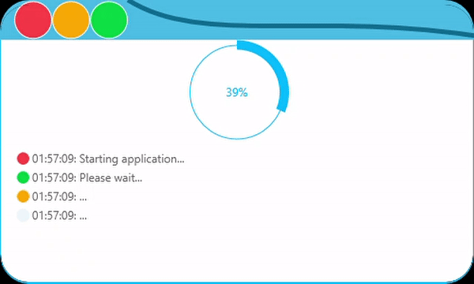
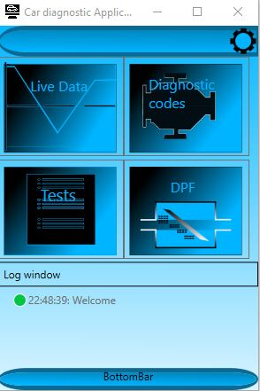

WPF application to simulate car diagnostics.

Mvvm, C#, Blend '19 used for controls design.

| Project name                                                          | Description                                                                          | Type                                  |
|-----------------------------------------------------------------------|--------------------------------------------------------------------------------------|---------------------------------------|
| JG.TechLearning.WPF.CarDiagnosticApp                                  | Main app for car diagnostic.                                                         | WPF App targeting .NET Core 3.0       |
| JG.TechLearning.WPF.CarDiagnostic.Converter                           | IValueConverters implementations.                                                    | Class Library targeting .NET Core 3.0 |
| JG.TechLearning.WPF.CarDiagnostic.DataSources.CarsMockDataSource      | Data source (car) mock.                                                              | .NET Standard 2.0                     |
| JG.TechLearning.WPF.CarDiagnostic.DataSources.IDataSource             | Interfaces and necessary models that are required by  data source to be implemented. | .NET Standard 2.0                     |
| JG.TechLearning.WPF.CarDiagnostic.DataSources.IDataSourcesPossessor   | Interfaces for data sources holders.                                                 | .NET Standard 2.0                     |
| JG.TechLearning.WPF.CarDiagnostic.DataSources.MockDataSourcesPossesor | Mock of data sources holder.                                                         | .NET Standard 2.0                     |
| JG.TechLearning.WPF.CarDiagnostic.Common                              | Common types / implementations used across several projects.                         | .NET Standard 2.0                     |
| JG.TechLearning.WPF.CarDiagnostic.ICommon                             | Common Interfaces.                                                                   | .NET Standard 2.0                     |
| JG.TechLearning.WPF.CarDiagnostic.MvvmMessages                        | Messages flying around the system  to which registration can be made.                | .NET Standard 2.0                     |
| JG.TechLearning.WPF.CarDiagnostic.UserControl                         | WPF xaml controls library (car-related).                                             | Class Library targeting .NET Core 3.0 |
| JG.TechLearning.WPF.CarDiagnostic.ViewModel                           | Viewmodels represents data that can  be shown in car diagnostic system.              | .NET Standard 2.0                     |
  ##### CI-Build: 

  ### Progress bar control
  
  
  
   ### Main view of the application (icons were made in blend)
  
