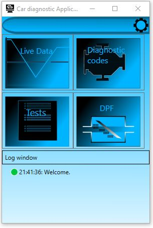

WPF application to simulate car diagnostics.

Mvvm, C#, Blend '19 used for controls design.

  ##### Travis-ci: 

  ### Progress bar control
  
  
  
   ### Main view of the application (icons were made in blend)
  
